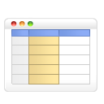
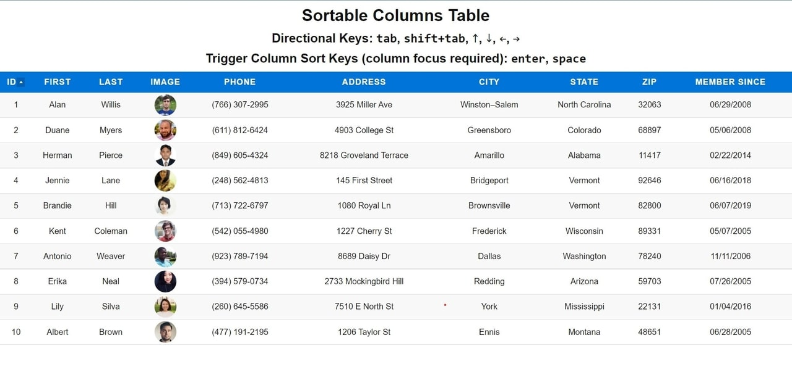
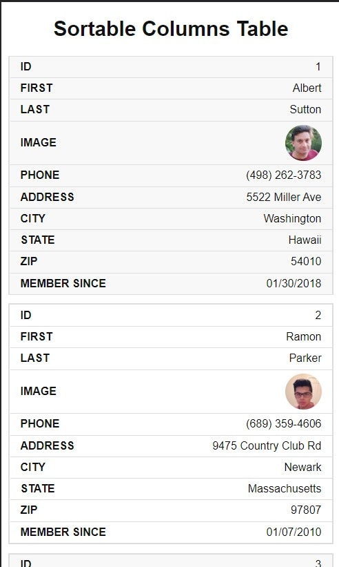

[](https://www.javascript.com)
[](https://GitHub.com/abuna1985/sortable-columns-table/commits/)
[](https://GitHub.com/abuna1985/sortable-columns-table/stargazers/)
[](https://GitHub.com/abuna1985/sortable-columns-tables/watchers/)
[](https://github.com/abuna1985/sortable-columns-tables/blob/main/LICENSE)
<br />

<div align="center">
  <a href="https://abuna1985.github.io/sortable-columns-table/">
    
  </a>

  <h2 align="center">Sortable Columns Table</h2>

  <p align="center">
    <a href="https://abuna1985.github.io/sortable-columns-table/">View Demo</a>
  </p>
</div>

## Table Of Contents

- [Table Of Contents](#table-of-contents)
- [About The Project](#about-the-project)
  - [Visual Examples](#visual-examples)
  - [Random User API](#random-user-api)
- [Requirements](#requirements)
  - [Bonus Requirements](#bonus-requirements)
- [My Process](#my-process)
  - [1. HTML](#1-html)
  - [2. JavaScript](#2-javascript)
  - [3. CSS](#3-css)
- [Built with](#built-with)
- [What I Learned](#what-i-learned)
  - [Web Accessability](#web-accessability)
  - [Performance Optimizations](#performance-optimizations)
  - [Using Modern CSS](#using-modern-css)
- [Continued Development](#continued-development)
  - [Additional Features](#additional-features)
- [Resources](#resources)
  - [HTML links](#html-links)
  - [CSS links](#css-links)
  - [JavaScript Links](#javascript-links)
- [Author](#author)
- [Acknowledgments](#acknowledgments)

## About The Project



This project is a simple single-page responsive design which takes data from the [Random User Generator API](https://randomuser.me/) and builds a table which can sorted by the column headers with a mouse and/or keyboard.

This project is a simple responsive single-page which takes data from the Random User Generator API and builds a table which can sorted by the column headers with a <code>click</code> of a mouse and/or <code>enter/space</code> key.

### Visual Examples

<details>
  <summary><strong>Click here</strong> to see what happens when the <em>columns are clicked on</em></summary>

Some stuff

</details>
<br />

<details>
  <summary><strong>Click here</strong> to see what happens when the <code>tab key</code> and <code>shift+tab key</code> is pressed</summary>

Some more stuff

</details>
<br>

<details>
  <summary><strong>Click here</strong> to see the mobile view of the page</summary>

<h3>Mobile View</h3>


</details>
<br>

### Random User API

Read the [API documentation](https://randomuser.me/documentation) to find out more about the response values and how to test the API. Notice the URL I am using for this project is requesting 10 users (`results=10`) from the United States (`nat=us`): `https://randomuser.me/api/?nat=us&results=10`

<details>
<summary><strong>Click Here</strong> to see the random user properties available</summary>

- `gender`: (string) gender (male/female),
- `name`: (object) contains name data
  - `title`: (string) title (Mr., Ms, etc)
  - `first`: (string) first name
  - `last`: (string) last name
- `location`: (object) contains location data
  - `street`: (string) street number and name
  - `city`: (string)city
  - `state`: (string) state
  - `postcode`: (string) zip/postal code
- `coordinates`: (object) contains coordinates data
  - `latitude`: (string) latitude
  - `longitude`: (string) longitude
- `timezone`: (object) contains time zone data
  - `offset`: (string) timezone offset
  - `description`: (string) time zone
- `email`: (string) email address
- `login`: (object) contains login data
  - `uuid`: (string) unique user id,
  - `username`: (string) username
  - `password`: (string) password
  - `salt`: (string) salt hash
  - `md5`: (string) md5 hash
  - `sha1`: (string) sha1 hash
  - `sha256`: (string) sha256 hash
- `dob`: (object) contains age data
  - `date`: (timestamp) date of birth
  - `age`: (number) age of person
- `registered`: (object) contains registration data
  - `date`: (timestamp) registration
  - `age`: (number) age of membership
- `phone`: (string) phone number
- `cell`: (string) cell phone number
- `id`: (object) contains id data
  - `name`: (string) id name
  - `value`: (string) id value
- `picture`: (object) contains picture data
  - `large`: (string) URL of large image
  - `medium`: (string) URL of medium image
  - `thumbnail`: (string) URL of thumbnail image
- `nat`: (string) nationality

</details>
<br>

[Back to Top](#table-of-contents)

## Requirements

1. Use the result a from the [Random User Generator API](https://randomuser.me/)
2. Use HTML, CSS and Javascript to show the data in a readable table (including mobile view)
3. All columns should have the ability to be sorted by mouse and/or keyboard

**As a user, I should:**

- [x] See a <code>loading</code> state when the page initially renders
- [x] See an HTML <code>table</code> when the data is successfully loaded
- [x] See an <code>error</code> message within the table body if it is not working
- [x] Be able to <code>click</code> on a column, see a visual cue that the column has been selected
- [x] Be able to use the following keyboard keys to control:
  - **Direction Keys**
    - [x] <code>tab</code>, <code>shift+tab</code>
    - [x] <code>&#8593;</code>, <code>&#8595;</code>, <code>&#8592;</code>, <code>&#8594;</code>
    - [x] <code>w</code>, <code>s</code>, <code>a</code>, <code>d</code>
    - [x] <code>home</code>, <code>end</code>
  - **Sorting**
    - [x] <code>enter</code>, <code>space</code></h2>

### Bonus Requirements

**As a developer, I should**

- [x] Implement 2 examples of caching in order to increase the overall performance of the page
- [x] Use the BEM (Block Element Modifier) naming convention for CSS class names
- [x] Use accessibility principles to ensure the page is accessible by the browser and any assistive technologies connected as well (i.e screen readers)

<br>

[Back to Top](#table-of-contents)

## My Process

Since the requirements were fetching API data and rendering a table, I approached it the following way:

### 1. HTML

Create an `index.html` file and fill it with the elements that were not going to be changing like the `<header>` and root `<table>` element. Add BEM (Block Element Modifier) naming convention for adding class names.

### 2. JavaScript

Create a `script.js` and write out the following functions:

- fetch data from the Random User API
  - render the contents of the `<table>` element (`<th>`, `<tr>`, `<td>`, etc.) with the Random User API data
    - Create Event Listeners:
      - **Click**
        - `<button>` in Column header (`<th>`)
          - when clicked, it sorts the table ascending/descending order and rerenders the page with the results
      - **Keydown**
        - `left arrow`, `up arrow`, `a`, `w`
          - Move the focus to the **previous** HTML element with a `tabindex` attribute
        - `right arrow`, `down arrow`, `d`, `s`
          - Move the focus to the **next** HTML element with a `tabindex` attribute
        - `home`
          - Move the focus to the **first** HTML element with a `tabindex` attribute
        - `end`
          - Move the focus to the **last** HTML element with a `tabindex` attribute

### 3. CSS

Create a `style.css`

- Add styles to
  - Header - `.c-header`
    - Header Title - `.c-header__title`
    - Header Subtitle - `.c-header__subtitle`
  - Table - `c-table`
    - table header
      - header cell (th) - `.c-table__th`
        - button - `.c-table__button`
    - table body
      - table row (tr) `.c-table__tr`
        - table data (td) `.c-table__td`
  - Loading Screen - `.l-loading-container` `.is-loading`
  - Animations
    - `move` keyframe animation
    - `grow` keyframe animation
  - Mobile view styling

[Back to Top](#table-of-contents)

## Built with

- Semantic HTML5
- CSS3
  - Normalize.css
  - CSS Animation (loading screen)
  - CSS custom properties
  - BEM naming convention
- ES6 JavaScript
  - Async/Await
  - Fetch
  - Closures/Memoization

[Back to Top](#table-of-contents)

## What I Learned

### Web Accessability

### Performance Optimizations

### Using Modern CSS

Use this section to recap over some of your major learnings while working through this project. Writing these out and providing code samples of areas you want to highlight is a great way to reinforce your own knowledge.

To see how you can add code snippets, see below:

```html
<h1>Some HTML code I'm proud of</h1>
```

```css
.proud-of-this-css {
	color: papayawhip;
}
```

```js
const proudOfThisFunc = () => {
	console.log('🎉');
};
```

If you want more help with writing markdown, we'd recommend checking out [The Markdown Guide](https://www.markdownguide.org/) to learn more.

[Back to Top](#table-of-contents)

## Continued Development

### Additional Features

1. In tablet/mobile view, add tab functionality to focus on each user box

[Back to Top](#table-of-contents)

## Resources

### HTML links

- [Web AIM - Creating accessible tables](https://webaim.org/techniques/tables/data)
- [MDN - HTML table advanced features and accessibility](https://developer.mozilla.org/en-US/docs/Learn/HTML/Tables/Advanced)
- [Deque University - Sortable table example](https://dequeuniversity.com/library/aria/table-sortable)
- [W3 - Sortable table example](https://w3c.github.io/aria-practices/examples/table/sortable-table.html)
- [HTML Symbols/Entity reference](https://www.toptal.com/designers/htmlarrows/)
- [Codepen - David Miller - Responsive table example](https://codepen.io/Orangetronic/full/pJgpXw)

### CSS links

- [MDN Docs - table-layout](https://developer.mozilla.org/en-US/docs/Web/CSS/table-layout)
- [LogRocket- CSS animated page loading](https://blog.logrocket.com/animated-page-loaders-css/)

### JavaScript Links

- [Go Make Things - JavaScript Event Delegation](https://gomakethings.com/listening-for-events-on-multiple-elements-using-javascript-event-delegation/) - This helped me better understand how event delegation works in JavaScript.
- [Go Make Things - Inject text and HTML with JavaScript](https://gomakethings.com/four-different-ways-to-inject-text-and-html-into-an-element-with-vanilla-javascript/) - This article helped me as a reference.
- [Random User API Documentation](https://randomuser.me/documentation#howto) Here is the documentation for the Random User API for reference.
- [JavaScript.info - Optional Chaining](https://javascript.info/optional-chaining)
- [MDN - switch statement](https://developer.mozilla.org/en-US/docs/Web/JavaScript/Reference/Statements/switch)
- [Go Make Things - Chris Ferndinandi - JavaScript format date helper function](https://vanillajstoolkit.com/helpers/formatdate/)
- [Mastering JS - Date object](https://masteringjs.io/tutorials/fundamentals/typeof-date)
- [freeCodeCamp - Understanding JavaScript Memoization](https://www.freecodecamp.org/news/understanding-memoize-in-javascript-51d07d19430e/)

[Back to Top](#table-of-contents)

## Author

- Website - [adamabundis.xyz](https://adamabundis.xyz/)
- GitHub - [@abuna1985](https://github.com/abuna1985)
- Twitter - [@adamabundis](https://twitter.com/adamabundis)

[Back to Top](#table-of-contents)

## Acknowledgments

This is where you can give a hat tip to anyone who helped you out on this project. Perhaps you worked in a team or got some inspiration from someone else's solution. This is the perfect place to give them some credit.

[Back to Top](#table-of-contents)
